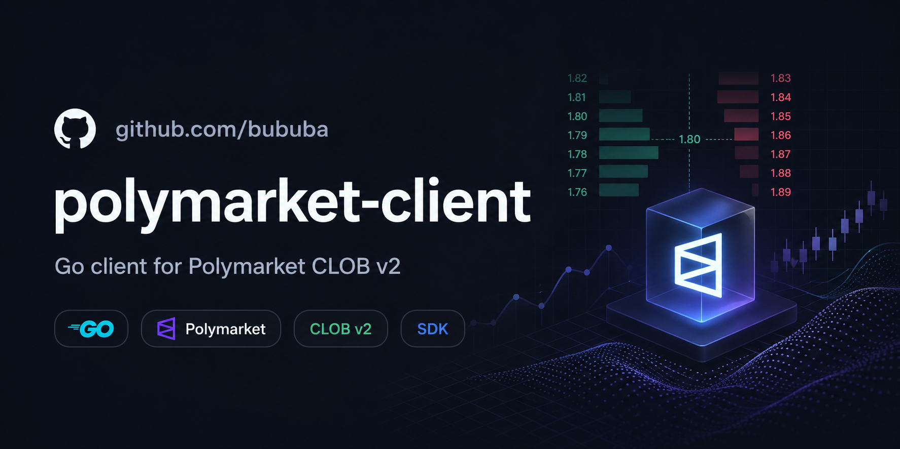

# polymarket-client

[](https://pkg.go.dev/github.com/bububa/polymarket-client)
[](https://goreportcard.com/report/github.com/bububa/polymarket-client)
[](https://github.com/bububa/polymarket-client/actions/workflows/go.yml)

> Go SDK for [Polymarket](https://polymarket.com) — the decentralized prediction market platform on Polygon.



## Features

- **Complete CLOB v2 coverage** — market data, order management, positions, RFQ (request-for-quote), rewards, builder APIs
- **WebSocket support** — live order book, price streams, and user order/trade events with auto-reconnect
- **Three-tier auth** — public (no auth), L1 (EIP-712 signatures), L2 (API key + passphrase + wallet signature)
- **All Polymarket APIs** — CLOB, Relayer, Data, Gamma, Bridge
- **Deposit wallet support** — `POLY_1271` CLOB order signing, balance/allowance updates, `WALLET-CREATE`, `WALLET` batch requests, and CTF helpers
- **CTF transaction helpers** — direct RPC, SAFE/PROXY relayer, and deposit-wallet WALLET execution paths
- **Zero live dependencies in tests** — most tests use `httptest.NewServer` and generated golden vectors; no live Polymarket calls are required
- **Ethereum signing support** — EIP-712, relayer, Safe/proxy, and ERC-7739-style deposit wallet order signatures

## Installation

```bash
go get github.com/bububa/polymarket-client
```

Requires **Go 1.22+**. The repository may test newer Go versions in CI.

## Quick Start

### Read-Only (No Auth Required)

```go
package main

import (
    "context"
    "fmt"

    "github.com/bububa/polymarket-client/clob"
)

func main() {
    client := clob.NewClient("") // defaults to CLOB v2 host

    // Fetch market data
    marketInfo := clob.ClobMarketInfo{ConditionID: "0xabc123"}
    if err := client.GetClobMarketInfo(context.Background(), &marketInfo); err != nil {
        panic(err)
    }
    fmt.Printf("Market: %s (negRisk=%v)\n", marketInfo.ConditionID, marketInfo.NegRisk)

    // Get order book (out must have AssetID set)
    book := clob.OrderBookSummary{AssetID: clob.String("token-id-here")}
    if err := client.GetOrderBook(context.Background(), &book); err != nil {
        panic(err)
    }
    fmt.Printf("Best bid: %v, Best ask: %v\n", book.Bids[0].Price, book.Asks[0].Price)
}
```

### Trading (L2 Authentication Required)

The easiest way to trade is using the `OrderBuilder`, which handles price
conversion, tick-size validation, and market option lookups automatically:

```go
package main

import (
    "context"
    "fmt"

    "github.com/bububa/polymarket-client/clob"
)

func main() {
    signer, err := clob.ParsePrivateKey("your-private-key-hex")
    if err != nil {
        panic(err)
    }

    client := clob.NewClient("",
        clob.WithCredentials(clob.Credentials{
            Key:        "your-api-key",
            Secret:     "your-api-secret",
            Passphrase: "your-api-passphrase",
        }),
        clob.WithSigner(signer),
        clob.WithChainID(clob.PolygonChainID), // 137
    )

    b := clob.NewOrderBuilder(client)

    // Place a limit order (auto-fetches tickSize and negRisk)
    resp, err := b.CreateAndPostOrderForToken(context.Background(), clob.OrderArgsV2{
        TokenID: "your-token-id",
        Price:   "0.50",   // price per share
        Size:    "10.0",   // number of shares
        Side:    clob.Buy,
    }, clob.GTC, nil)
    if err != nil {
        panic(err)
    }
    fmt.Printf("Order placed: %s (success=%v)\n", resp.OrderID, resp.Success)
}
```

For advanced use cases (pre-fetched market options, custom tick-size handling):

```go
b := clob.NewOrderBuilder(client)

// Advanced: manually supply tickSize and negRisk
args := clob.OrderArgsV2{
    TokenID: "your-token-id",
    Price:   "0.50",
    Size:    "10.0",
    Side:    clob.Buy,
}
opts := clob.CreateOrderOptions{TickSize: "0.01", NegRisk: false}

order, err := b.BuildOrder(args, opts)
if err != nil {
    panic(err)
}

// Then post manually
resp, err := b.CreateAndPostOrder(ctx, args, opts, clob.GTC, nil)
```

> **Note**: `OrderBuilder` only constructs, validates, signs, and optionally
> submits orders. It does **not** check balance, allowance, or reserved
> open-order capacity. The caller is responsible for ensuring sufficient
> funds before posting.

### Using Other APIs

```go
// Data API — positions, trades, activity (no auth)
import "github.com/bububa/polymarket-client/data"

dataClient := data.New(data.Config{})
positions, _ := dataClient.GetPositions(ctx, data.PositionParams{User: "0x..."})

// Gamma API — events, markets search, tags (no auth)
import "github.com/bububa/polymarket-client/gamma"

gammaClient := gamma.New(gamma.Config{})
markets, _ := gammaClient.GetMarkets(ctx, gamma.MarketFilterParams{/* ... */})

// Relayer API — submit signed transactions (L1 auth via API key)
import "github.com/bububa/polymarket-client/relayer"

relayerClient := relayer.New(relayer.Config{
    Credentials: &relayer.Credentials{
        APIKey:  "...",
        Address: "0x...",
    },
})

// Bridge API — deposit, withdraw, bridge status (no auth)
import "github.com/bububa/polymarket-client/bridge"

bridgeClient := bridge.New(bridge.Config{})
assets, _ := bridgeClient.GetSupportedAssets(ctx, &bridge.SupportedAssetsResponse{})
```

### Deposit Wallet Relayer Examples

Deposit wallets use the relayer `WALLET-CREATE` and `WALLET` flows. The CLOB package provides chain-aware wrappers so callers do not need to hard-code the Polygon deposit wallet factory.

Deploy a deterministic deposit wallet:

```go
client := clob.NewClient("",
    clob.WithSigner(signer),
    clob.WithChainID(clob.PolygonChainID),
    clob.WithRelayerClient(relayer.New(relayer.Config{
        Credentials: &relayer.Credentials{
            APIKey:  "relayer-api-key",
            Address: signer.Address().Hex(),
        },
    })),
)

var deployResp relayer.SubmitTransactionResponse
if err := client.DeployDepositWallet(ctx, &deployResp); err != nil {
    panic(err)
}
fmt.Println("relayer tx:", deployResp.TransactionID)
```

For CTF operations, prefer the high-level convenience methods instead of manually building a generic `WALLET` batch. They build the CTF calldata, wrap it in a deposit-wallet `WALLET` request, sign it, and submit it through the configured relayer:

```go
contracts, err := clob.Contracts(clob.PolygonChainID)
if err != nil {
    panic(err)
}

var resp relayer.SubmitTransactionResponse
err = client.SplitPositionWithDepositWallet(ctx, &clob.SplitPositionRequest{
    CollateralToken:    contracts.Collateral,
    ParentCollectionID: common.Hash{},
    ConditionID:        conditionID,
    Partition:          clob.BinaryPartition(),
    Amount:             big.NewInt(1_000_000),
}, &clob.DepositWalletCTFArgs{
    DepositWallet: "0xDepositWalletAddress",
    Deadline:      "1760000000",
    Metadata:      "split-position",
}, &resp)
if err != nil {
    panic(err)
}
```

Use `DepositWalletBatch` / `DepositWalletBatchRelayerRequest` only when you need a generic wallet batch that is not already covered by a CTF helper. If `Nonce` is empty, the client fetches `type=WALLET` nonce from the configured relayer. Pass `Nonce` explicitly for deterministic tests or offline request construction.


## Package Overview

| Package                               | Purpose                                                  | Default Host                                 | Auth Required       |
| ------------------------------------- | -------------------------------------------------------- | -------------------------------------------- | ------------------- |
| [`clob`](#clob-package)               | CLOB v2 — orders, markets, positions, RFQ                | `https://clob.polymarket.com`                | Depends on endpoint |
| [`clob/ws`](#clobws-package)          | WebSocket live order book, prices & user events          | `wss://ws-subscriptions-clob.polymarket.com` | L2 (user only)      |
| [`clob/ws/rtds`](#clobwsrtds-package) | WebSocket real-time data subscriptions                   | _(see rtds package)_                         | None                |
| [`relayer`](#relayer-package)         | Submit signed on-chain transactions                      | `https://relayer-v2.polymarket.com`          | API key             |
| [`data`](#data-package)               | Positions, trades, activity, leaderboard                 | `https://data-api.polymarket.com`            | None                |
| [`gamma`](#gamma-package)             | Market search, events, tags, profiles                    | `https://gamma-api.polymarket.com`           | None                |
| [`bridge`](#bridge-package)           | Bridge API — deposit, withdraw, quotes                   | `https://bridge.polymarket.com`              | None                |
| [`shared`](#shared-package)           | Shared scalar types (`String`, `Int`, `Float64`, `Time`) | —                                            | —                   |

## Authentication

Polymarket uses three authentication levels:

| Level            | Description   | How It Works                             | Endpoints                      |
| ---------------- | ------------- | ---------------------------------------- | ------------------------------ |
| **AuthNone (0)** | Public access | No headers                               | Market data, orderbook, prices |
| **AuthL1 (1)**   | Wallet-signed | EIP-712 signature of timestamp + nonce   | `CreateAPIKey`, `DeriveAPIKey` |
| **AuthL2 (2)**   | Full trading  | API key + HMAC-secret + wallet signature | Orders, trades, positions, RFQ |

L2 auth requires BOTH a `polyauth.Signer` (from your private key) AND `Credentials` (API key, secret, passphrase).

### Creating API Keys

```go
signer, err := clob.ParsePrivateKey("your-private-key-hex")
if err != nil {
    panic(err)
}

client := clob.NewClient("",
    clob.WithSigner(signer),
    clob.WithChainID(clob.PolygonChainID),
)

// Create new API key (L1 — wallet-signed)
var creds clob.Credentials
err := client.CreateAPIKey(ctx, nonce, &creds)
// Use returned credentials for L2 requests
```

### Signature Types and Wallet Models

CLOB v2 orders support multiple wallet/signature modes:

| Signature type | Constant | Typical maker/signer shape |
| -------------- | -------- | -------------------------- |
| EOA | `SignatureTypeEOA` | `maker`/`signer` are the EOA signer |
| Proxy | `SignatureTypeProxy` | `maker` is the proxy/funder wallet |
| Safe | `SignatureTypeGnosisSafe` | `maker` is the Safe/funder wallet |
| Deposit wallet | `SignatureTypePoly1271` | `maker` and `signer` are the deposit wallet; the cryptographic signer is the owner/session signer |

For deposit-wallet CLOB orders, set `SignatureTypePoly1271` and set `Maker` to the deposit wallet address. The SDK fills `Signer` as the same deposit wallet and signs the `POLY_1271` / ERC-7739-wrapped order signature:

```go
sigType := clob.SignatureTypePoly1271

order, err := b.BuildOrder(clob.OrderArgsV2{
    TokenID:       "token-id",
    Price:         "0.42",
    Size:          "10",
    Side:          clob.Buy,
    SignatureType: &sigType,
    Maker:         "0xDepositWalletAddress",
}, clob.CreateOrderOptions{
    TickSize: "0.01",
    NegRisk:  false,
})
if err != nil {
    panic(err)
}
```

Before trading from a deposit wallet, refresh balance/allowance state with `signature_type=3`:

```go
var allowance clob.BalanceAllowanceResponse
err := client.UpdateBalanceAllowance(ctx, clob.BalanceAllowanceParams{
    AssetType:     clob.AssetCollateral,
    SignatureType: clob.SignatureTypePoly1271,
}, &allowance)
if err != nil {
    panic(err)
}

// Conditional-token allowance refresh also includes token_id.
err = client.UpdateBalanceAllowance(ctx, clob.BalanceAllowanceParams{
    AssetType:     clob.AssetConditional,
    TokenID:       "token-id",
    SignatureType: clob.SignatureTypePoly1271,
}, &allowance)
```


## CLOB Package

### Market Data (No Auth)

| Method                         | Endpoint                       | Description                          |
| ------------------------------ | ------------------------------ | ------------------------------------ |
| `GetOk`                        | `/ok`                          | Health check                         |
| `GetVersion`                   | `/version`                     | API version                          |
| `GetServerTime`                | `/time`                        | Server timestamp                     |
| `GetMarkets`                   | `/markets`                     | Paginated markets (full details)     |
| `GetSimplifiedMarkets`         | `/simplified-markets`          | Paginated markets (simplified)       |
| `GetSamplingMarkets`           | `/sampling-markets`            | Paginated sampled markets            |
| `GetSamplingSimplifiedMarkets` | `/sampling-simplified-markets` | Paginated sampled simplified markets |
| `GetMarket`                    | `/markets/:id`                 | Single market by condition ID        |
| `GetMarketByToken`             | `/markets-by-token/:id`        | Single market by token ID            |
| `GetClobMarketInfo`            | `/clob-markets/:id`            | CLOB metadata for market             |
| `GetOrderBook`                 | `/book`                        | Order book for token                 |
| `GetOrderBooks`                | `/books`                       | Batch order books (POST)             |
| `GetMidpoint`                  | `/midpoint`                    | Midpoint price for token             |
| `GetMidpoints`                 | `/midpoints`                   | Batch midpoint prices (POST)         |
| `GetPrice`                     | `/price`                       | Last price by token + side           |
| `GetPrices`                    | `/prices`                      | Batch last prices (POST)             |
| `GetSpread`                    | `/spread`                      | Bid-ask spread for token             |
| `GetSpreads`                   | `/spreads`                     | Batch spreads (POST)                 |
| `GetLastTradePrice`            | `/last-trade-price`            | Most recent trade for token          |
| `GetLastTradesPrices`          | `/last-trades-prices`          | Batch last trade prices (POST)       |
| `GetTickSize`                  | `/tick-size`                   | Min price increment by token         |
| `GetTickSizeByTokenID`         | `/tick-size/:id`               | Min price increment by token ID      |
| `GetNegRisk`                   | `/neg-risk`                    | Neg-risk flag for token              |
| `GetFeeRate`                   | `/fee-rate`                    | Fee rate for token                   |
| `GetFeeRateByTokenID`          | `/fee-rate/:id`                | Fee rate by token ID                 |
| `GetPricesHistory`             | `/prices-history`              | Historical price data                |
| `GetBatchPricesHistory`        | `/batch-prices-history`        | Batch price history (POST)           |
| `GetMarketTradesEvents`        | `/markets/live-activity/:id`   | Live trade activity for market       |

### Orders & Trading (AuthL2)

| Method                   | Endpoint                     | Description                                   |
| ------------------------ | ---------------------------- | --------------------------------------------- |
| `PostOrder`              | `/order`                     | Submit single order                           |
| `PostOrders`             | `/orders`                    | Submit batch orders (`postOnly`, `deferExec`) |
| `CancelOrder`            | `/order`                     | Cancel by order ID                            |
| `CancelOrders`           | `/orders`                    | Cancel multiple orders                        |
| `CancelAll`              | `/cancel-all`                | Cancel all user orders                        |
| `CancelMarketOrders`     | `/cancel-market-orders`      | Cancel by market                              |
| `GetOrder`               | `/data/order/:id`            | Get order by ID                               |
| `GetOpenOrders`          | `/data/orders`               | List open orders from the current page        |
| `GetOpenOrdersPage`      | `/data/orders`               | Return the paginated open-order response      |
| `GetPreMigrationOrders`  | `/data/pre-migration-orders` | Pre-v2 migration orders                       |
| `GetTrades`              | `/data/trades`               | List user trades                              |
| `IsOrderScoring`         | `/order-scoring`             | Check if order is scoring                     |
| `AreOrdersScoring`       | `/orders-scoring`            | Batch scoring check                           |
| `GetBalanceAllowance`    | `/balance-allowance`         | Token balance + allowance                     |
| `UpdateBalanceAllowance` | `/balance-allowance/update`  | Update token allowance                        |
| `GetNotifications`       | `/notifications`             | User notifications                            |
| `DropNotifications`      | `/notifications`             | Mark notifications read                       |
| `PostHeartbeat`          | `/v1/heartbeats`             | Send heartbeat                                |

### Auth & Account Management

| Method                 | Auth | Description                  |
| ---------------------- | ---- | ---------------------------- |
| `CreateAPIKey`         | L1   | Generate new API key         |
| `DeriveAPIKey`         | L1   | Derive API key from nonce    |
| `GetAPIKeys`           | L2   | List active API keys         |
| `DeleteAPIKey`         | L2   | Revoke active API key        |
| `GetClosedOnlyMode`    | L2   | Check restricted mode status |
| `CreateBuilderAPIKey`  | L2   | Generate builder API key     |
| `GetBuilderAPIKeys`    | L2   | List builder API keys        |
| `RevokeBuilderAPIKey`  | L2   | Revoke builder API key       |
| `CreateReadonlyAPIKey` | L2   | Generate read-only API key   |
| `GetReadonlyAPIKeys`   | L2   | List read-only API keys      |
| `DeleteReadonlyAPIKey` | L2   | Revoke read-only API key     |

### OrderBuilder (Recommended for Trading)

The `OrderBuilder` provides a high-level API that automatically fetches
`tickSize` and `negRisk` from the CLOB API, so you don't need to supply them:

```go
b := clob.NewOrderBuilder(client)

// Limit order — auto-fetches tickSize + negRisk
resp, err := b.CreateAndPostOrderForToken(ctx, clob.OrderArgsV2{
    TokenID: "token-id",
    Price:   "0.50",
    Size:    "10.0",
    Side:    clob.Buy,
}, clob.GTC, nil)

// Market order — Amount is USDC for BUY, shares for SELL
resp, err := b.CreateAndPostMarketOrderForToken(ctx, clob.MarketOrderArgsV2{
    TokenID: "token-id",
    Price:   "0.50",   // worst-price limit
    Amount:  "100",    // BUY: USDC to spend / SELL: shares to sell
    Side:    clob.Buy,
}, clob.FOK, nil)
```

**Token-based builders** (auto-fetch market options, build + sign only):

```go
// Build only (no submit)
order, err := b.BuildOrderForToken(ctx, clob.OrderArgsV2{...})
marketOrder, err := b.BuildMarketOrderForToken(ctx, clob.MarketOrderArgsV2{...})
```

**Advanced builders** (manually supply tickSize and negRisk):

```go
args := clob.OrderArgsV2{TokenID: "...", Price: "0.50", Size: "10.0", Side: clob.Buy}
opts := clob.CreateOrderOptions{TickSize: "0.01", NegRisk: false}

order, err := b.BuildOrder(args, opts)
marketOrder, err := b.BuildMarketOrder(clob.MarketOrderArgsV2{...}, opts)
resp, err := b.CreateAndPostOrder(ctx, args, opts, clob.GTC, nil)
resp, err := b.CreateAndPostMarketOrder(ctx, mktArgs, opts, clob.FOK, nil)
```

**Order types**: `GTC`, `GTD` for limit orders; `FOK`, `FAK` for market orders.

> `deferExec` (post-only) is only valid with `GTC`/`GTD`. Pairing it with
> `FOK`/`FAK` returns an error.

### RFQ (Request for Quote) (AuthL2)

| Method                  | Endpoint                     | Description                  |
| ----------------------- | ---------------------------- | ---------------------------- |
| `CreateRFQRequest`      | `/rfq/request`               | Create RFQ                   |
| `CancelRFQRequest`      | `/rfq/request`               | Cancel RFQ                   |
| `GetRFQRequests`        | `/rfq/data/requests`         | List RFQs                    |
| `CreateRFQQuote`        | `/rfq/quote`                 | Create RFQ quote             |
| `CancelRFQQuote`        | `/rfq/quote`                 | Cancel RFQ quote             |
| `GetRFQRequesterQuotes` | `/rfq/data/requester/quotes` | Quotes received as requester |
| `GetRFQQuoterQuotes`    | `/rfq/data/quoter/quotes`    | Quotes provided as quoter    |
| `GetRFQBestQuote`       | `/rfq/data/best-quote`       | Best matching quote          |
| `AcceptRFQRequest`      | `/rfq/request/accept`        | Accept RFQ                   |
| `ApproveRFQQuote`       | `/rfq/quote/approve`         | Approve quote                |
| `GetRFQConfig`          | `/rfq/config`                | RFQ configuration            |

### Rewards (AuthL2 + Public)

| Method                            | Auth | Description                   |
| --------------------------------- | ---- | ----------------------------- |
| `GetEarningsForUserForDay`        | L2   | User rewards for a date       |
| `GetTotalEarningsForUserForDay`   | L2   | Total user rewards for a date |
| `GetRewardPercentages`            | L2   | Reward percentage multipliers |
| `GetUserEarningsAndMarketsConfig` | L2   | Earnings + market config      |
| `GetCurrentRewards`               | None | Active reward campaigns       |
| `GetRewardsForMarket`             | None | Rewards for a market          |
| `GetBuilderFeeRate`               | None | Builder fee configuration     |

### Builder APIs (AuthL2 + Public)

| Method              | Auth | Description                    |
| ------------------- | ---- | ------------------------------ |
| `GetBuilderTrades`  | L2   | Builder referral trade history |
| `GetCurrentRebates` | L2   | Current maker rebate rates     |

### CTF On-Chain Helpers

The CTF helpers build and execute `splitPosition`, `mergePositions`, `redeemPositions`, and neg-risk redemption transactions.

| Path | Methods | Description |
| ---- | ------- | ----------- |
| Build only | `BuildSplitPositionTx`, `BuildMergePositionsTx`, `BuildRedeemPositionsTx`, `BuildRedeemNegRiskTx` | Build `CTFTransaction{To, Data}` without submitting |
| Direct RPC | `SplitPosition`, `MergePositions`, `RedeemPositions`, `RedeemNegRisk` | Sign and submit through a configured RPC URL |
| SAFE / PROXY relayer | `BuildCTFRelayerRequest`, `SubmitCTFRelayerTransaction`, `SplitPositionRelayer`, `MergePositionsRelayer`, `RedeemPositionsRelayer`, `RedeemNegRiskRelayer` | Sign and submit existing CTF calldata through legacy relayer flows |
| Deposit wallet | `CTFDepositWalletTransactionRequest`, `SubmitCTFDepositWalletTransaction`, `SplitPositionWithDepositWallet`, `MergePositionsWithDepositWallet`, `RedeemPositionsWithDepositWallet`, `RedeemNegRiskWithDepositWallet` | Wrap CTF calldata in a deposit-wallet `WALLET` request |

Prefer the operation-level deposit wallet helpers for CTF actions. They are safer than manually assembling a `CTFTransaction` because they validate the operation request, build the calldata, wrap it in a deposit-wallet `WALLET` request, sign it, and submit it in one call.

Split a binary market position through a deposit wallet:

```go
contracts, err := clob.Contracts(clob.PolygonChainID)
if err != nil {
    panic(err)
}

amount := big.NewInt(1_000_000) // pUSD base units

var resp relayer.SubmitTransactionResponse
err = client.SplitPositionWithDepositWallet(ctx, &clob.SplitPositionRequest{
    CollateralToken:    contracts.Collateral,
    ParentCollectionID: common.Hash{}, // top-level Polymarket markets
    ConditionID:        conditionID,
    Partition:          clob.BinaryPartition(),
    Amount:             amount,
}, &clob.DepositWalletCTFArgs{
    DepositWallet: "0xDepositWalletAddress",
    Deadline:      "1760000000",
    Metadata:      "split-position",
}, &resp)
if err != nil {
    panic(err)
}
```

Merge a full binary outcome set back into collateral:

```go
err = client.MergePositionsWithDepositWallet(ctx, &clob.MergePositionsRequest{
    CollateralToken:    contracts.Collateral,
    ParentCollectionID: common.Hash{},
    ConditionID:        conditionID,
    Partition:          clob.BinaryPartition(),
    Amount:             amount,
}, &clob.DepositWalletCTFArgs{
    DepositWallet: "0xDepositWalletAddress",
    Deadline:      "1760000000",
    Metadata:      "merge-positions",
}, &resp)
```

Redeem resolved positions:

```go
err = client.RedeemPositionsWithDepositWallet(ctx, &clob.RedeemPositionsRequest{
    CollateralToken:    contracts.Collateral,
    ParentCollectionID: common.Hash{},
    ConditionID:        conditionID,
    IndexSets:          clob.BinaryPartition(),
}, &clob.DepositWalletCTFArgs{
    DepositWallet: "0xDepositWalletAddress",
    Deadline:      "1760000000",
    Metadata:      "redeem-positions",
}, &resp)
```

Redeem a neg-risk market through the neg-risk adapter:

```go
err = client.RedeemNegRiskWithDepositWallet(ctx, &clob.RedeemNegRiskRequest{
    ConditionID: conditionID,
    Amounts: []*big.Int{
        big.NewInt(1_000_000),
        big.NewInt(2_000_000),
    },
}, &clob.DepositWalletCTFArgs{
    DepositWallet: "0xDepositWalletAddress",
    Deadline:      "1760000000",
    Metadata:      "redeem-neg-risk",
}, &resp)
```

For lower-level control, `CTFDepositWalletTransactionRequest` can wrap an already-built `CTFTransaction`, but most callers should use the `*WithDepositWallet` helpers above. `BuildCTFRelayerRequest` intentionally handles only SAFE / PROXY relayer flows.

### WebSocket (`clob/ws`)

```go
import "github.com/bububa/polymarket-client/clob/ws"

wsClient := ws.New(
    ws.WithHost(""), // defaults to production
    ws.WithAutoReconnect(true),
    // Optional: auth for user-channel subscriptions
    ws.WithCredentials(&clob.Credentials{
        Key:        "your-api-key",
        Secret:     "your-api-secret",
        Passphrase: "your-api-passphrase",
    }),
)
defer wsClient.Close()

// Connect to market channel (for order book, prices, etc.)
if err := wsClient.ConnectMarket(ctx); err != nil {
    panic(err)
}

// Subscribe to order book
err = wsClient.SubscribeOrderBook(ctx, []string{"token-id"})
// Subscribe to price changes
err = wsClient.SubscribePrices(ctx, []string{"token-id"})
// Subscribe to order updates (requires auth + ConnectUser)
err = wsClient.ConnectUser(ctx)
err = wsClient.SubscribeOrders(ctx, []string{"market-condition-id"})

// Read events
for event := range wsClient.Events() {
    fmt.Printf("Event: %+v\n", event)
}
// Read errors
for err := range wsClient.Errors() {
    fmt.Printf("Error: %v\n", err)
}
```

**Market subscriptions** (no auth): `SubscribeOrderBook`, `SubscribePrices`, `SubscribeMidpoints`, `SubscribeLastTradePrice`, `SubscribeTickSizeChange`, `SubscribeBestBidAsk`, `SubscribeNewMarkets`, `SubscribeMarketResolutions`.

**User subscriptions** (auth required, via `ConnectUser`): `SubscribeUserEvents`, `SubscribeOrders`, `SubscribeTrades`.

Each subscribe method accepts `ctx context.Context` and a slice of asset IDs (market) or market condition IDs (user).

### WebSocket Real-Time Data (`clob/ws/rtds`)

The `rtds` subpackage provides WebSocket real-time data stream subscriptions
for market data without needing the full CLOB client.


## Relayer Package

The `relayer` package exposes the raw Relayer v2 client and wire types used by the CLOB convenience wrappers.

```go
relayerClient := relayer.New(relayer.Config{
    Credentials: &relayer.Credentials{
        APIKey:  "relayer-api-key",
        Address: "0xOwnerAddress",
    },
})
```

Supported relayer transaction types:

| Type | Constant | Purpose |
| ---- | -------- | ------- |
| `PROXY` | `relayer.NonceTypeProxy` | Legacy proxy-wallet relayer transaction |
| `SAFE` | `relayer.NonceTypeSafe` | Safe relayer transaction |
| `WALLET-CREATE` | `relayer.NonceTypeWalletCreate` | Deploy deterministic deposit wallet |
| `WALLET` | `relayer.NonceTypeWallet` | Execute signed deposit-wallet batch |

`relayer.SubmitTransactionRequest` uses optional fields so wallet flows do not send empty legacy fields. `SignatureParams` is a pointer and should be set only for SAFE / PROXY requests. For chain-aware deposit-wallet flows, prefer the CLOB wrappers (`DeployDepositWallet`, `DepositWalletBatch`, and CTF deposit-wallet helpers), because contract addresses live in `clob.Contracts(chainID)`.

## Development

```bash
# Build
go build -v ./...

# Run tests (all offline — httptest.NewServer)
go test -v ./...

# Tidy dependencies
go mod tidy
```

### Test Files

Golden vectors under `testdata/golden/py-clob-client-v2` compare selected CLOB v2 order signing paths against Polymarket's Python SDK, including deposit-wallet `POLY_1271` order signatures.


| File                         | Coverage                                                         |
| ---------------------------- | ---------------------------------------------------------------- |
| `clob/auth_test.go`          | Auth header generation, HMAC signatures                          |
| `clob/client_test.go`        | CLOB v2 endpoints, flexible JSON parsing                         |
| `clob/ctf_test.go`           | CTF relayer transaction submission                               |
| `clob/ctf_validation_test.go` | CTF builder input validation and panic prevention                |
| `clob/deposit_wallet_*_test.go` | Deposit wallet signing, relayer, CTF, and batch helpers        |
| `clob/amount_test.go`        | Amount calculation, tick validation, bytes32 checks              |
| `clob/order_builder_test.go` | OrderBuilder price invariants, market order semantics, deferExec |
| `clob/sign_order_test.go`    | V2 signing, domain hash, expiration handling                     |
| `relayer/client_test.go`     | Relayer documented endpoints                                     |
| `shared/flex_test.go`        | Flexible JSON scalar serialization                               |

## License

[MIT](LICENSE)
