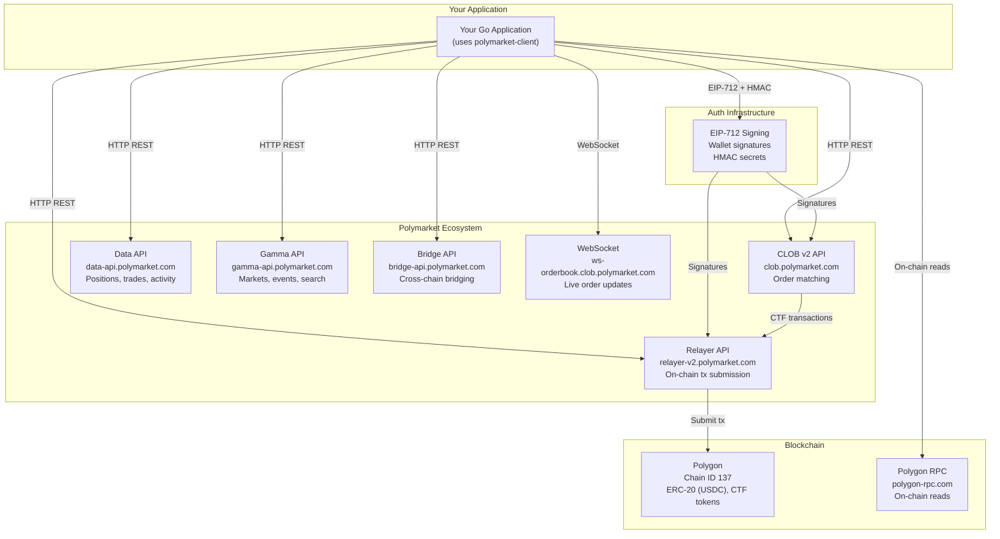
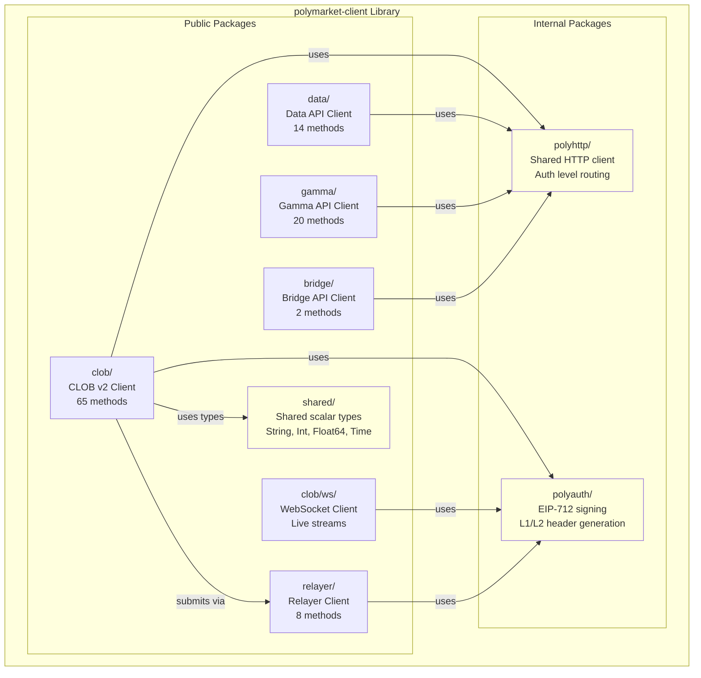
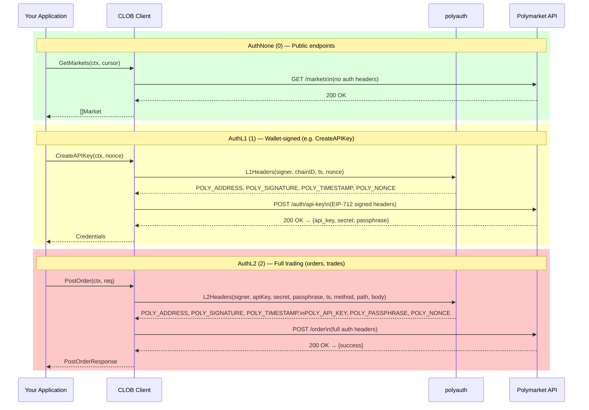
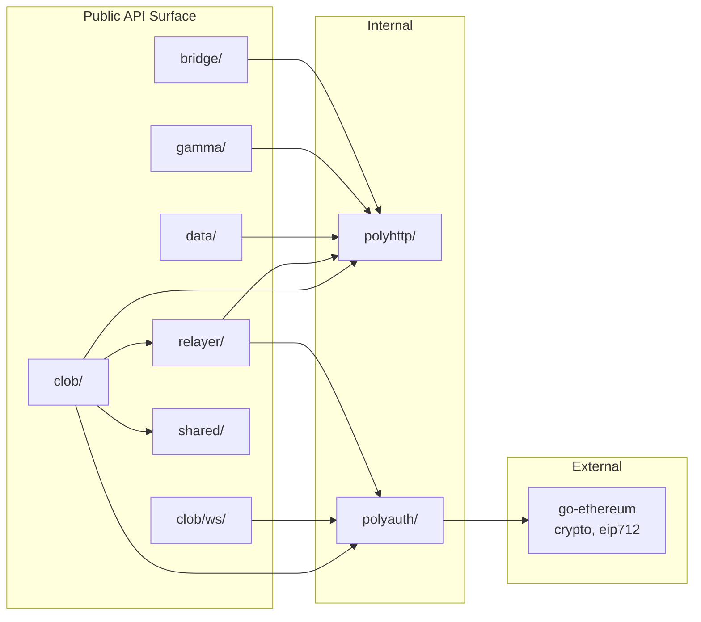
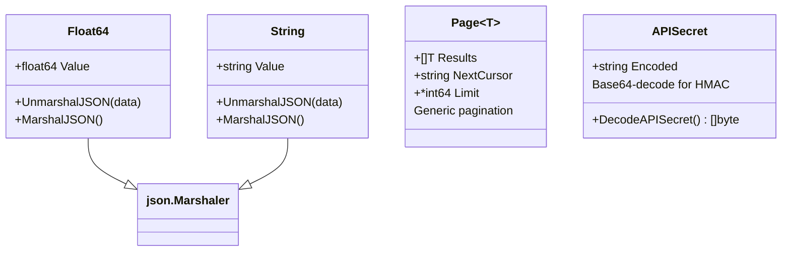
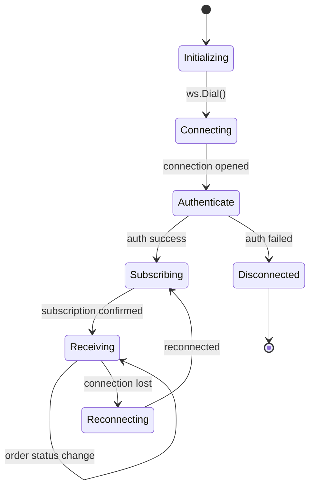
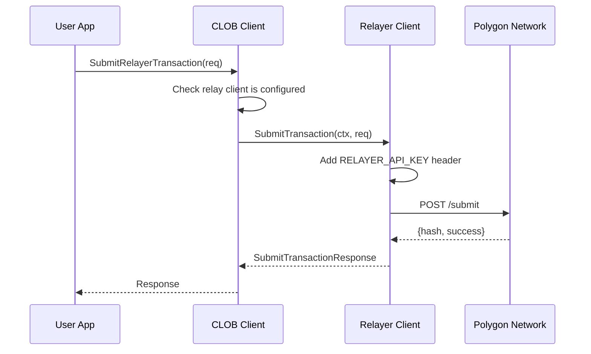

# Architecture

Polymarket Client is a pure-Go SDK wrapping five distinct Polymarket HTTP APIs and one WebSocket API, all running on the Polygon blockchain. The library has no binaries — it is consumed as a Go module by applications.

## System Context (C4 Level 1)



## Container Diagram (C4 Level 2)



## Authentication Flow

Three-tier authentication with increasing privilege:



## Package Dependency Graph



## Request Processing Pipeline

Every HTTP request flows through this pipeline:

```mermaid
flowchart LR
    A["Client method\n(e.g. GetMarkets)"] --> B["Build URL + query params"]
    B --> C["Marshal body\n(if POST/DELETE)"]
    C --> D["Create http.Request"]
    D --> E{"Auth level?"}

    E -->|0 (None)| F["No auth headers"]
    E -->|1 (L1)| G["polyauth.L1Headers()\nEIP-712 signature"]
    E -->|2 (L2)| H["polyauth.L2Headers()\nAPI key + HMAC + wallet sig"]

    F --> I["Execute request"]
    G --> I
    H --> I
    I --> J{"Status OK?"}
    J -->|2xx| K["Unmarshal JSON\n→ out value"]
    J -->|4xx/5xx| L["Return APIError\nwith status + body"]
```

## Key Type System

Polymarket returns numeric values as both raw JSON numbers **and** decimal strings. The SDK handles this via custom types:



- **`Float64`** — always unmarshals as `float64`, accepts both `"0.50"` and `0.50`
- **`String`** — accepts strings, numbers, and booleans while preserving a stable string form
- **`Page[T]`** — generic pagination with `NextCursor`, used throughout CLOB and rewards APIs

## WebSocket Architecture



The WebSocket client (`clob/ws`) uses gorilla/websocket internally, maintains a read loop in a goroutine, and channels updates to the caller via `client.Channel`. Reconnection is not automatic — the caller must handle `ErrConnectionLost` and re-subscribe.

## CLOB–Relayer Integration

The CLOB client can optionally be configured with a Relayer client for on-chain CTF (Conditional Token Framework) operations:



This is configured via `clob.WithRelayerClient(relayerClient)` or `clob.WithRelayerSubmitter(submitter)`. Without it, `SubmitRelayerTransaction` returns `"polymarket: relayer client is not configured"`.
