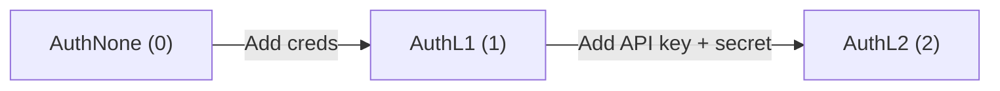

# Authentication Levels

Polymarket uses three authentication tiers to control API access:



| Level | Headers Used | Required Setup | Capabilities |
|---|---|---|---|
| **AuthNone (0)** | None | Nothing | Read market data, order books, prices |
| **AuthL1 (1)** | `POLY_ADDRESS`, `POLY_SIGNATURE`, `POLY_TIMESTAMP`, `POLY_NONCE` | `WithSigner(privateKey)` | Create/derive API keys |
| **AuthL2 (2)** | All L1 headers + `POLY_API_KEY`, `POLY_PASSPHRASE` | `WithSigner` + `WithCredentials` | Orders, trades, positions, RFQ |

## Setting Up Authentication

```go
client := clob.NewClient("",
    clob.WithSigner(polyauth.NewSigner(privateKey)),
    clob.WithChainID(clob.PolygonChainID), // 137
)

// Step 1: Create API key (L1)
creds, err := client.CreateAPIKey(ctx, nonce)

// Step 2: Use credentials for L2
client = clob.NewClient("",
    clob.WithCredentials(*creds),
    clob.WithSigner(polyauth.NewSigner(privateKey)),
    clob.WithChainID(clob.PolygonChainID),
)
```

See [L1](auth-l1) and [L2](auth-l2) guides for details.
